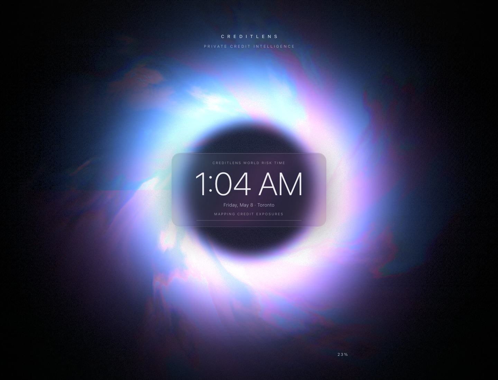
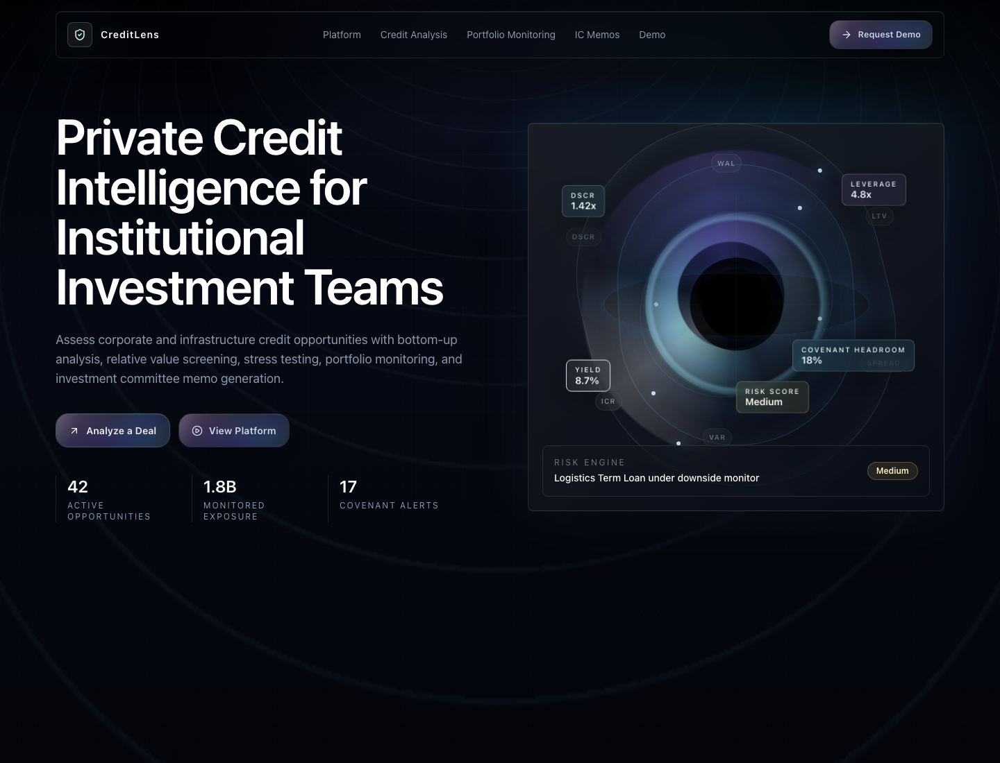
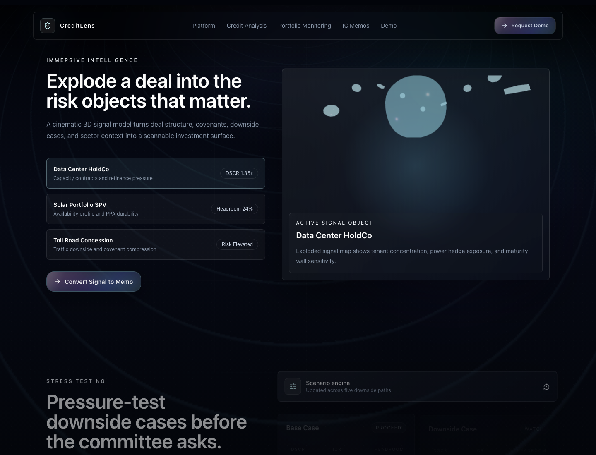
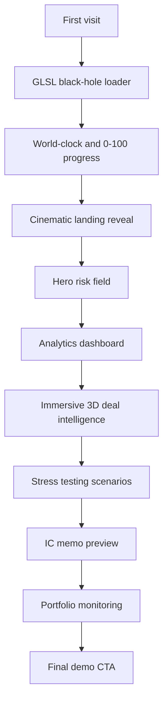
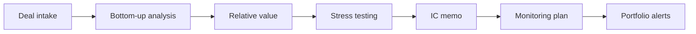
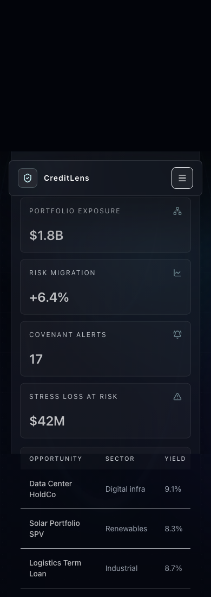

# CreditLens

**Live demo:** https://utyagi005.github.io/CreditLens/  
**GitHub releases:** https://github.com/utyagi005/CreditLens/releases

CreditLens is a premium private credit and infrastructure credit analytics landing experience designed for institutional investment teams. It presents a cinematic GLSL black-hole loading sequence, a liquid-glass fintech visual system, dashboard previews, stress-testing workflows, investment committee memo generation, and portfolio monitoring.



## Case Study

### Challenge

Private credit platforms often need to communicate rigor and trust while still feeling modern enough for AI-assisted investment workflows. The goal was to avoid a generic SaaS template and instead create a flagship product experience that feels closer to an institutional analytics terminal: cinematic, data-rich, calm, and premium.

### Outcome

CreditLens now opens with a GPU shader-driven loading screen using React Three Fiber, Three.js, GLSL, and post-processing. The landing page then transitions into a cohesive dark visual system with shader-inspired buttons, frosted navigation, risk-field visuals, dashboard previews, stress scenarios, memo generation, and an immersive 3D deal-intelligence section.



## Design Decisions

### 1. Cinematic Loader As Product Signal

The loader is not a decorative splash screen. It frames CreditLens as a risk engine coming online: a black-hole center, liquid plasma ring, chromatic glow, film grain, loading progress, and a live world-clock overlay. The world-clock interaction links to a global time reference because private credit teams coordinate across markets, committees, and counterparties.

### 2. Institutional Glass System

The interface uses near-black depth, graphite panels, cool-gray type, thin alpha borders, cyan/violet highlights, restrained glow, and liquid shader buttons. The goal was to feel premium and technical without drifting into crypto neon or gaming UI.

### 3. Data-First Storytelling

Every major visual element maps to the product domain: DSCR, leverage, yield, covenant headroom, risk migration, sector exposure, scenario stress, watchlist names, and IC memo structure. The page sells the workflow by showing believable product surfaces, not abstract marketing cards.

### 4. Immersive 3D Risk Objects

The 3D section turns a deal into explodable risk objects. It gives recruiters and users a memorable interaction while staying tied to credit analysis: capacity contracts, refinance pressure, PPAs, traffic downside, covenant compression, and maturity-wall sensitivity.



## Experience Architecture





## Responsive Design

The mobile layout preserves the same institutional tone while stacking the dashboard, hero, and shader controls into narrow, readable panels. The implementation was verified for no horizontal overflow.



## Technical Stack

- React 19 + TypeScript + Vite
- Tailwind CSS
- Framer Motion
- Three.js + React Three Fiber
- GLSL fragment shaders
- `@react-three/drei`
- `@react-three/postprocessing`
- Vitest
- GitHub Pages deployment

## Key Components

- `AppLoader`
- `ShaderLoadingScreen`
- `ClockOverlay`
- `ShaderButton`
- `CinematicBackground`
- `RiskFieldVisual`
- `DashboardPreview`
- `DealIntelligenceLab`
- `StressTesting`
- `MemoPreview`
- `PortfolioMonitoring`
- `FinalCTA`

## Run Locally

```bash
npm install
npm run dev
```

## Verify

```bash
npm test
npm run lint
npm run build
```
